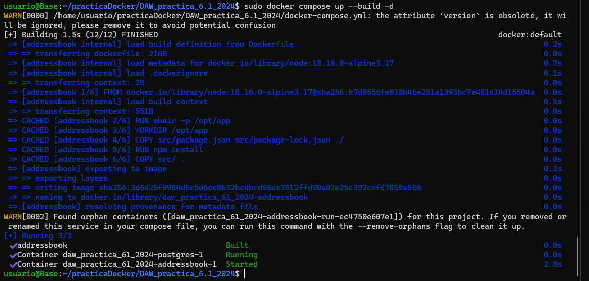

# Practica 6.1 Docker. 
## ¿Porque usar Docker?
Al usar docker sobre apliaciones, obtendremos varias ventajas. Una de ellas es la configuración rápida y uniforme del entorno de desarrollo, esto evitará problemas de compatibilidad entre equipos. Permite despliegues más ágiles. También simplifica la gestión de múltiples entornos mediante cambios de variables de entorno. 

## Despliegue con Docker. 
Clonaremos el siguiente [repositorio](https://github.com/raul-profesor/DAW_practica_6.1_2024.git) en nuestra máquina con el siguiente comando. 
```console
$ git clone https://github.com/raul-profesor/DAW_practica_6.1_2024.git
```

Tras esto, dentro de la aplicación ya viene el archivo **Dockerfile**, el cual es necesario dentro del directorio para construir la imagen y correr el contenedor. Su contenido es el siguiente. 


### Explicación del archivo
1. FROM -> Indica que vamos a utilizar la imagen de Docker Hub oficial de Node, en su versión 18.16.0 junto con Alpine. 
2. RUN -> Ejecuta un comando en una nueva capa de imagen. 
3. WORKDIR -> Define el directorio sobre el que se ejecutarán las subsiguientes instrucciones del Dockerfile. 
4. COPY -> Copia los archivos que le indiquemos dentro del contenedor, en este caso sería el package.json.
5. RUN -> Ejecutamos el comando que nos instala las dependencias que se indican en el archivo package.json. 
6. COPY -> Copiamos todos los archivos de nuestro directorio /src al contenedor. 
7. EXPOSE -> Nos permite documentar que puertos están expuestos.
8. CMD -> Permite ejecutar un comando dentro del contenedor. En este caso iniciaremos la aplcación. 

El siguiente paso es hacer un build de la imagen del Docker. Indicaremos que ésta se llama librodirecciones y que haga el build con el contexto del directorio actual de trabajo así como del Dockerfile que hay en el 


Ahora iniciamos el contenedor con nuestra aplicación. Con -p le decimos que escuche conexiones entrantes de cualquier máquina en el puerto 3000 de nuestra máquina anfitrión. Con la opción -d lo haremos correr en modo demonio en el background: 


## Docker Compose. 
### ¿Que es Docker Compose?
Es una herramienta que permite definir y administrar varios contenedores de Docker en un solo archivo YAML. Facilita la ejecución de aplicaciones que dependen de varios servicios, como una API con una base de datos. 

El siguiente archivo es el YAML del que hemos previamente hablado. 


Ahora ejecutaremos el siguiente comando para levantar nuestra infraestructura basada en contenedores:


Este comando creará las tablas necesarias en la base de datos. Y construiremos nuestros contenedores a partir de las imágenes. 



Ya construidas las imágenes, podemos levantar los contenedores. Correremos unos test para comprobar que la aplicación funciona correctamente. 


Comprobaciones para comprobar que la aplicación junto con la BBDD funciona correctamente. 


